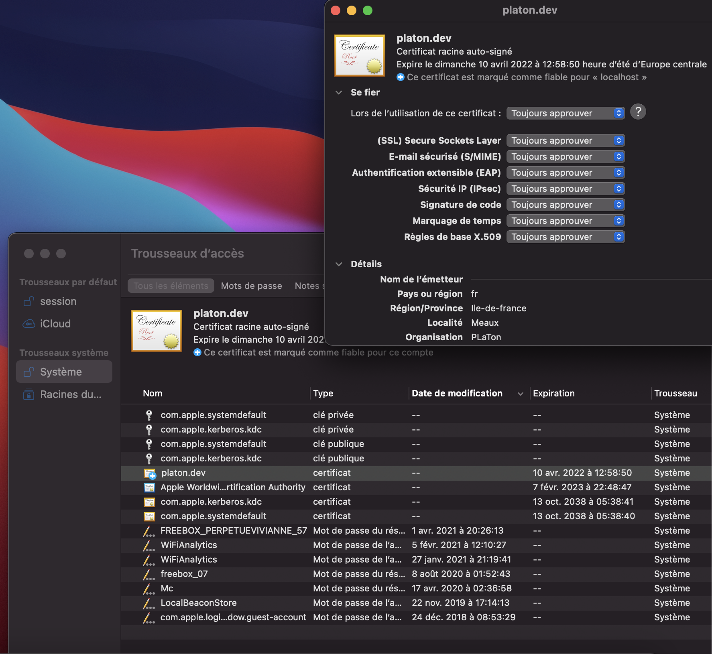

<!-- markdownlint-disable MD033 -->

<h1 align="center"> PLaTon</h1>

<p align="center">

</p>

<p align="center">
Platform for Learning and Teaching online. <br/>
This repository is the entry point to the PLaTon platform for developers, it's the one you should clone to start contributing to PLaTon or to deploy it on your server.</br>
Also please create your issues on this repository and we will transfer them to the right repository.
</p>

<p align="center">
    <a href="https://github.com/PremierLangage/platon/blob/master/LICENSE">
        
    </a>
</p>

## Projects status

[sandbox](https://github.com/PremierLangage/sandbox/)

[](https://github.com/PremierLangage/sandbox/actions/)

[platon-server](https://github.com/PremierLangage/platon-server/)

[](https://github.com/PremierLangage/sandbox/actions/)

[platon-front](https://github.com/PremierLangage/platon-front/)

[](https://github.com/PremierLangage/sandbox/actions/)

## Development

### Prerequisites

In order to run PLaTon you'll need the following tools installed

- [`Docker`](https://www.docker.com)
- [`OpenSSL`](https://www.openssl.org)
- [`ca-certificates`](https://packages.debian.org/fr/sid/ca-certificates) (only on a linux system)
- [`Visual Studio Code`](https://code.visualstudio.com)

### Recommendations

> We recommend you to install the
[Docker](https://marketplace.visualstudio.com/items?itemName=ms-azuretools.vscode-docker) and the [Remote development](https://marketplace.visualstudio.com/items?itemName=ms-vscode-remote.vscode-remote-extensionpack) extensions on vscode. The first one will allow you to use docker inside the editor and the second to use docker as a full-featured development environment.

> You will be asked to install the extensions on the first time you will open the project, but if not you can also display the recommendations by opening the command palette of vscode (`CTRL + P` on Linux and `CMD + P` on Mac) then type the following text
<p align="left">
    
</p>

> Also if you are using docker for mac, we recommend you to increase the memory size to 4GB in the resources section of the docker dashboard.
<p align="left">
    
</p>

### Installation

Since the platform depends on multiple services like a PostgreSQL database, Elasticsearch, Python, Node, Angular and others projects of the organization... the development process is fully dockerized. All the coding, running, testing and deployment takes place inside docker containers so you don't have to install anything on your system except [`Docker`](https://www.docker.com) and [`Visual Studio Code`](https://code.visualstudio.com).

You are free to develop on the OS of your choice, it's does not matter thanks to docker, but we recommend you to choose a Linux or an OSX system since the project is fully tested on these two platforms.

1.
    First of all, you should clone this repository on your system using the      following command

    ```sh
    git clone https://github.com/PremierLangage/platon
    ```

2.
    Go to the `platon` directory and execute the `./bin/install.sh` script

    ```sh
    cd platon
    ./bin/install.sh
    ```

    This script will clone the repositories needed to run PLaTon outside of the current directory:

    - [platon-server](https://github.com/PremierLangage/platon-server) -> backend of the platform written with [django](https://www.djangoproject.com).

    - [platon-front](https://github.com/PremierLangage/platon-front) -> frontend of the platform written with [Angular](https://angular.io)

    - [sandbox](https://github.com/PremierLangage/sandbox) -> server to execute code inside of a secured and isolated environment, written with [django](https://www.djangoproject.com).

    This will give you the following directory structure:

    ```text
    platon/
        ...
    platon-front/
        ...
    platon-server/
        ...
    sandbox/
    ```

    After, it will generate some files like

    - `.env` file into the current directory
    - `config.json` file into `../platon-server/platon/config.json`
    - `ssl` certificates into `server/certs`
    - ...

    Please continue reading this guide to learn more about all the generated files and directories.

3.
    Generate docker images of PLaTon services

    ```sh
    ./bin/dev-build.sh
    ```

4.
    Run PLaTon with nginx inside docker and open the browser on `https://platon.dev`

    > This will work because `platon.dev` host is added to the `/etc/hosts/` file of your system by the install script and a `ssl` certificate is generated under the directory `server/certs` to be used by nginx.

    ```sh
    ./bin/dev-up.sh
    ```

    At this point, you will see an error in your browser like the following one:

    <p align="left">
        
    </p>

    The message and the way you will fix it  might be different depending on the browser.

    - On **Firefox**, you should open the page `about:config` in a new tab and toggle off the `network.stricttransportsecurity.preloadlist` setting then refresh the page, you will now see an option to bypass the warning.
    <p align="left">
        
    </p>

    - On **Chrome**, click a blank section of the denial page.
    Using your keyboard, type `thisisunsafe`. This will add the website to a safe list, where you should not be prompted again.
    Strange steps, but it surely works!

    - On **Safari** for mac, you should add `server/certs/platon.dev.crt` the Keychain app, then approve the `platon.dev` certificate by double click on it.
    <p align="left">
        
    </p>

### Scripts

In addition to these 3 scripts, the project contains other scripts placed in the bin folder:

| Script | Description | When to use |
| --- | --- | --- |
| `dev-build.sh` | Install the development environment (by building Docker images). | Before running `dev-up.sh` (don't worry docker will cache the build and rebuild only if a change occurs to the requirements of the frontend of backend) |
| `dev-up.sh` | Execute all development services. |  When you wan't to run PLaTon in development mode |
| `dev-down.sh` | Stop all development services. |  When you wan't to stop the docker containers |
| `install.sh` | Clones the repositories and add some default config files (This script will not clone the repositories if you already have them and it will not override your config files). |  Only once or when you pull a change from this repository. |
| `prod-build.sh` | Install the production environment (by building Docker images). | Same as the `dev-build script` for prod environment.  |
| `prod-up.sh` | Execute all production services.. |  Same as the `dev-up script` for prod environment.  |
| `prod-down.sh` | Stop all development services.. |  Same as the `dev-down script` for prod environment.  |
| `shell-api.sh` | Connect to the backend container. | To run `manage.py` commands for example (the dev or prod services must be started before in order to run this script)?-. |
| `shell-app.sh` | Connect to the frontend project container. | To run `ng` commands to run unitests for example (the dev or prod services must be started before in order to run this script). |
| `shell-postgres.sh` | Connect to the postgres database container. | To run `psql` commands to create a dump for example (the dev or prod services must be started before in order to run this script). |

### Open container inside vscode

Instead of developing directly on your host machine, or using the **shell-*** scripts, we recommend you to run the containers inside vscode. The projects are configured to install some useful vscode extensions.

<p align="left">

</p>

<https://code.visualstudio.com/docs/remote/attach-container>

When you develop inside of a container, vscode will automatically config git from the config on the host system so please use git directly inside the containers instead of the host machine.

Also, it will recommend you to install some extensions based on the container your'e working on.

## Architecture

PLaTon is organized through different technical services:

- [Django REST Framework](https://www.django-rest-framework.org) to write a REST API.
- [Django Channels](https://channels.readthedocs.io/en/stable/) to create websocket endpoints.
- [Angular](https://angular.io) to create the frontend application of the platform.
- [PostgreSQL](https://www.postgresql.org) to store the data of the platform.
- [Elasticsearch](https://django-elasticsearch-dsl.readthedocs.io/en/latest/quickstart.html) to add a full text search feature to the platform.
- [Celery](https://docs.celeryproject.org/en/stable/) to create automated tasks.
- [Redis](https://redis.io) to add a caching layer on top of Django Channels and Celery.
- [Nginx](https://www.nginx.com) to serve all theses services on the same server  using a reverse proxy system.

To use all these services at the same, PLaTon use [Docker](https://www.docker.com) to run each service inside a container and connect them using a docker-compose file.

### Development stacks

The following diagram represents the stack of the platform in a development environment.

<p align="left">

</p>

In a development environment:

- Django will served on the port `8000` using `python3 manage.py runserver` command (Django will also serve the static files and the media files).
- Angular will be served on the port `7000` using `npm start` command.
- Nginx will listen on port `80` (http) and `443` (https) to forward the requests to Django or Angular depending on the requested url prefix.
- Postgres, Redis and Elasticsearch will listen on their own standard port.
- The sandbox is the only service that is not be dockerized. You must install it on your system and start it using `python3 manage.py runserver IP:7000`.

HOT reloading is enabled in this mode since angular and django are started using a dedicated webserver so any time a file change in the projects, the code will be recompiled. This works thanks to [docker volumes](https://www.freecodecamp.org/news/how-to-enable-live-reload-on-docker-based-applications/) (the source codes will be mounted inside the containers).

### Production stacks

The following diagram represents the stack of the platform in a production environment.

<p align="left">

</p>

In a production environment:

- Django will be served on port `8000` using [Uvicorn](https://www.uvicorn.org).
- Angular will be compiled a volume that is mounted inside the nginx container.
- Nginx will act as a reverse proxy like for the development environment. It will redirect api and websocket requests to uvicorn and will serve django static files and angular pages.

### Cross-origin resource sharing (CORS)

You might have experienced that using a lot of different ports is confusing while developping services locally: it often involves cross-origin resource sharing which need to be allowed. Cross-origin resource sharing let a domain access the data on an another one. When you need to access your data from a different domain, you need to allow this domain to query the data.

CORS is allowed in the settings of the django project.

### Environment variables

The following table list all the environment variables defined inside the `.env` file of the repository. This file allow to config the services of the docker-compose like the ports where the tools will be started.

> This file is not versionned, it will be generated by the `./bin/install.sh` script. So if a future version of the repository adds a new environment variable, you should add it by yourself by comparing the local content of the file and the one comming from github.

| Name | Service | Description | Default |
| --- | --- | --- | -- |
| COMPOSE_HTTP_TIMEOUT | docker | Increase docker build timeout which is set to 20 by default | 200 |
| POSTGRES_USER | postgres | Owner of the database created inside the postgres service. | django |
| POSTGRES_PASSWORD | postgres | Password of the database created inside the postgres service. | django_password |
| POSTGRES_DB | postgres |  Name of the database created inside the postgres service. | django_platon |
| PG_DATA | postgres | Directory where to store the data inside the postgres service. | PG_DATA=/var/lib/postgresql/data |
| DEBUG | api | Sets django's [DEBUG](https://docs.djangoproject.com/fr/3.1/ref/settings/#debug) value settings | true |
| ALLOWED_HOSTS | api | Sets django's [ALLOWED_HOSTS](https://docs.djangoproject.com/fr/3.1/ref/settings/#allowed-hosts) value setting | 127.0.0.1,localhost,platon.dev |
| DB_NAME | api | Sets django's [DATABASES](https://docs.djangoproject.com/fr/3.1/ref/settings/#allowed-hosts) name value setting | django_platon |
| DB_USERNAME | api | Sets django's [DATABASES](https://docs.djangoproject.com/fr/3.1/ref/settings/#allowed-hosts) name value setting | django |
| DB_PASSWORD | api | Sets django's [DATABASES](https://docs.djangoproject.com/fr/3.1/ref/settings/#allowed-hosts) password value setting | django_password |
| DB_HOST | api | Sets django's [DATABASES](https://docs.djangoproject.com/fr/3.1/ref/settings/#allowed-hosts) host value setting  | 172.17.0.1 |
| DB_PORT | api | Sets django's [DATABASES](https://docs.djangoproject.com/fr/3.1/ref/settings/#allowed-hosts) port value setting  | 5431 |
| REDIS_HOST | api | Sets django's `REDIS_HOST` value setting | 172.17.0.1 |
| REDIS_PORT | api | Sets django's `REDIS_PORT` value setting | 6379 |
| ELASTICSEARCH_HOST | api | Sets django's `ELASTICSEARCH_HOST` value setting | 172.17.0.1 |
| ELASTICSEARCH_PORT | api | Sets django's `ELASTICSEARCH_PORT` value setting  | 9200 |
| SANDBOX_URL | api | Sets django's `SANDBOX_URL` value setting  | <http://localhost:7000/> |

> You must define the host part of the SANDBOX_URL to your IP address instead of localhost since the sandbox is not dockerized.

## Backend

TODO

## Frontend

TODO

## Sandbox

TODO

## Deployment

TODO

## Contributing

TODO
